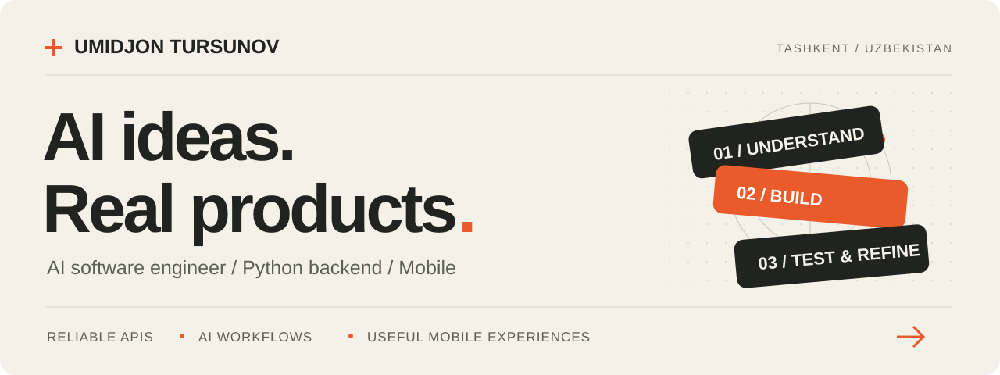

  <picture>
  <source media="(max-width: 600px)" srcset="./assets/profile-banner-mobile.svg" />
  
  </picture>

  <a href="https://www.linkedin.com/in/tursunovumidjon"><strong>LinkedIn</strong></a> &nbsp; / &nbsp;
  <a href="mailto:tursunov.umidjon.uz@gmail.com"><strong>Email</strong></a> &nbsp; / &nbsp;
  <a href="https://t.me/muydinov_u"><strong>Telegram</strong></a> &nbsp; / &nbsp;
  <a href="https://github.com/umidjontursunovhbai?tab=repositories"><strong>Public projects ↗</strong></a>

 

I build **AI-assisted products, Python backends, and mobile workflows**. My work connects what users experience with what happens behind the scenes: APIs, payments, chat, and operations.

I focus on making the difficult parts reliable — subscription upgrades, credit accounting, changing auth state, and conversations that stay consistent when the network doesn't.

### Product contributions

<table>
<tr>
<td width="50%" valign="top">
<picture><source media="(max-width: 600px)" srcset="./assets/wakil-mobile.svg" /></picture>

Fixed <strong>Standard-to-Pro upgrades and credit accounting</strong> across backend and web. Added regression tests for payments, billing periods, and concurrent credit use.

</td>
<td width="50%" valign="top">
<picture><source media="(max-width: 600px)" srcset="./assets/utax-mobile.svg" /></picture>

Improved <strong>Flutter chat search and navigation</strong>, attachment readiness, persistent local auth, and user-facing error and cancellation flows.

</td>
</tr>
<tr>
<td width="50%" valign="top">
<picture><source media="(max-width: 600px)" srcset="./assets/kusherbayev-mobile.svg" /></picture>

Isolated search failures, kept <strong>outgoing messages visible during server lag</strong>, prevented deleted chats from returning, and refined message copying.

</td>
<td width="50%" valign="top">
<picture><source media="(max-width: 600px)" srcset="./assets/bride-mobile.svg" /></picture>

Improved <strong>multi-office check-in and schedule reliability</strong>. Connected Linear and Gmail activity to the mobile inbox and fixed email rendering across API and Flutter clients.

</td>
</tr>
</table>

### What I work with

| Backend | Mobile | AI & integrations |
| :--- | :--- | :--- |
| Python · FastAPI · PostgreSQL | Flutter / Dart · SwiftUI | AI agents · MCP · API & webhook integrations |

I use **Docker, Linux, and automated tests** to support delivery and maintenance.

### A few things you can explore

- **[SmartSpend](https://github.com/umidjontursunovhbai/SmartSpend)** — a native iOS expense tracker with budgets, recurring expenses, and Home Screen widgets.
- **[Project Ledger](https://github.com/umidjontursunovhbai/project-ledger)** — a project finance workspace for income, expenses, invoices, team access, and billing imports.
- **[Telegram DM Assistant](https://github.com/umidjontursunovhbai/telegram-dm-assistant)** — an AI inbox assistant with local reply drafts and configurable auto-replies.

<strong>Earlier experience & ongoing learning</strong>

 

**UzVIP · AI Automation Engineer · Jun–Oct 2025**  
Built n8n workflows connecting AI services, webhooks, and business systems for chat, scheduling, and e-commerce. Worked on a multi-model chat flow with payment integration and natural-language workflows that created structured workspace records.

I'm also learning machine learning through [linear regression experiments](https://github.com/umidjontursunovhbai/ml-linear-regression-projects) and [TinyTrack AI](https://github.com/umidjontursunovhbai/tinytrack-ai), a 2D driving environment I'm building toward reinforcement learning.

---

<strong>Have a useful problem to solve?</strong> <a href="mailto:tursunov.umidjon.uz@gmail.com">Let's build something that works.</a>

